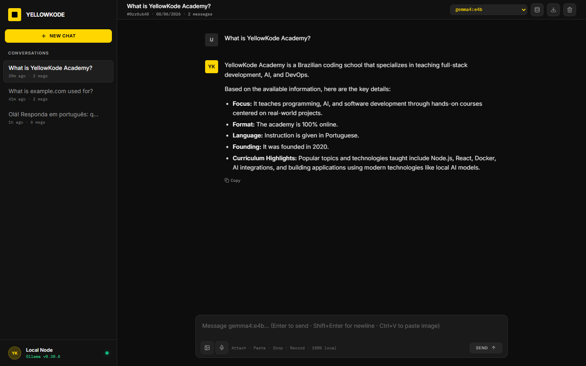
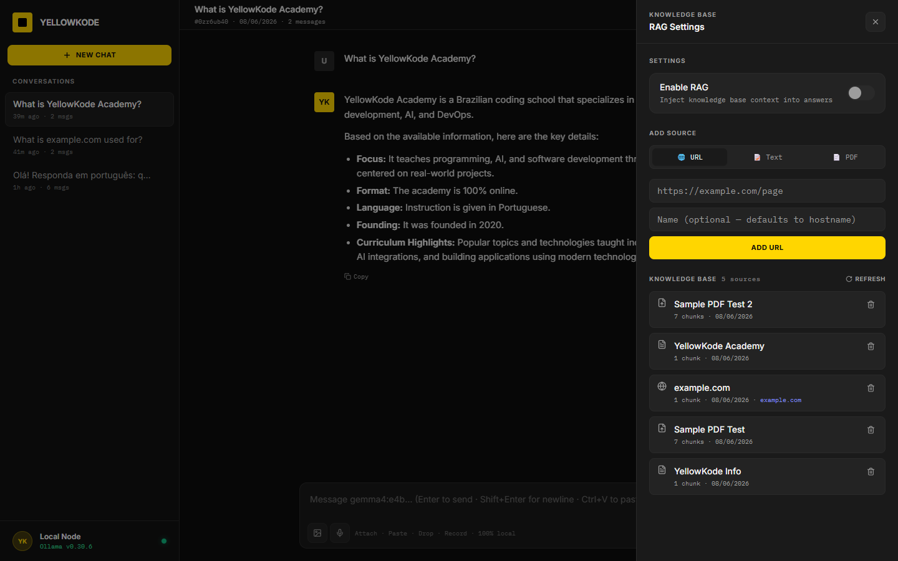

# YellowKode Chat

Local AI chat interface, no account, no API key, no cost.


> 🇧🇷 [Versão em Português](README.pt-BR.md)

## Screenshots

| Chat | Knowledge Base (RAG) |
|---|---|
|  |  |

---

## What it is

A chat interface powered by a local LLM, runs **100% on your machine**. No accounts, no tokens, no API keys.

Powered by **Gemma 4** via [Ollama](https://ollama.com).

## Getting started

**Requirement:** [Docker Desktop](https://www.docker.com/products/docker-desktop/)

```bash
git clone <url> yk-chat
cd yk-chat
cp .env.example .env
docker compose up -d
```

Open at **http://localhost:3000**

> On first run, the model is downloaded automatically (~2.5 GB for `gemma4:e4b`).
> Monitor progress with `docker compose logs -f model-init`.

## Features

- Real-time streaming responses
- Multiple conversations with history saved locally
- Model switcher in the header (any Ollama model)
- Paste images (Ctrl+V), drag & drop, file attach
- Export conversation as JSON
- **Knowledge Base (RAG)**: add URLs, text snippets, or PDFs; the chat uses that content to answer, with a badge showing how many sources were used

## Models

| Model | RAM | Best for |
|---|---|---|
| `gemma4:e2b` | ~1 GB | Low-memory machines |
| `gemma4:e4b` | ~2.5 GB | **Recommended** |
| `gemma4:12b` | ~7 GB | Higher quality responses |
| `llama3.2` | ~2 GB | Lightweight alternative |

Edit `OLLAMA_MODEL` in `.env` to switch models.

## Commands

```bash
docker compose logs -f          # live logs
docker compose ps               # service status
docker compose down             # stop
docker compose down -v          # stop and delete all data
```

---

MIT License, [YellowKode](https://yellowkode.com) + [Wunka Tech](https://wunka.tech)
